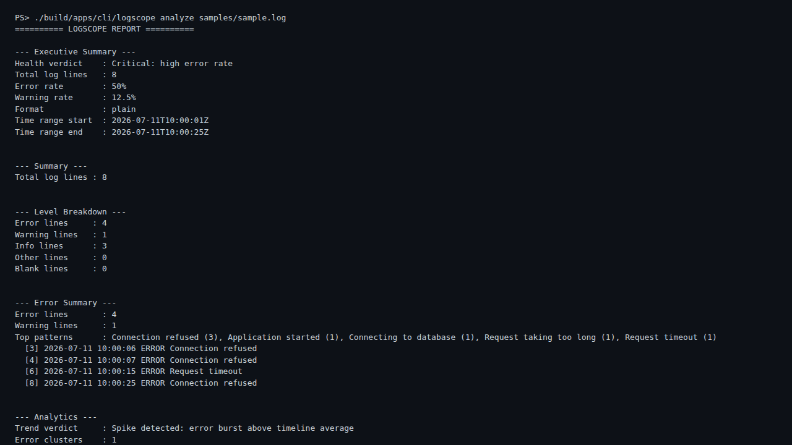
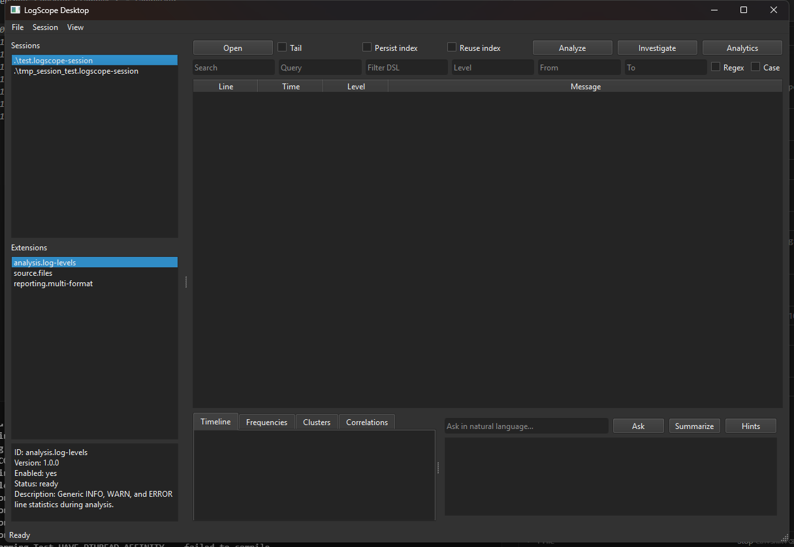
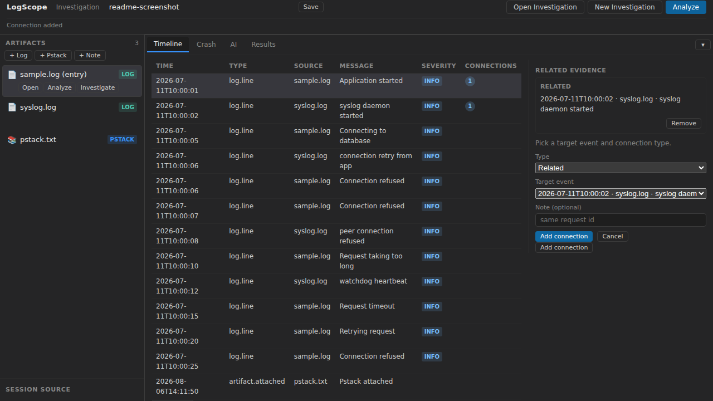

# LogScope

[](https://github.com/AntonyCyriac/logscope/actions/workflows/ci.yml)
[](https://github.com/AntonyCyriac/logscope/releases/latest)
[](LICENSE)
[](#install)

**Investigate any log format — CLI, desktop, or browser.** Parse, search, report, and persist indexes without one-off scripts.

| Surface | Binary | Best for |
|---------|--------|----------|
| **CLI** | `logscope` | Automation, CI, power users |
| **Desktop** | `logscope-desktop` | Interactive analysis, live tail, export |
| **Web** | `logscope-web` | Shared workspaces, REST API, team access |

## Screenshots

**CLI** — analyze and investigate from the terminal:



**Desktop** — real `logscope-desktop` with `samples/sample.log` analyzed (8 lines):



**Web** — real `logscope-web` SPA (v2.2.1, session ready):



**Current release:** [`v2.2.1`](CHANGELOG.md) — M15.4 thin auth (session TTL, upload cleanup, [securing guide](docs/handbook/SECURING_LOGSCOPE_WEB.md)). [Roadmap](docs/ROADMAP.md) · [Changelog](CHANGELOG.md) · [Downloads](https://github.com/AntonyCyriac/logscope/releases/latest)

---

## Why LogScope

Engineers still grep giant files, stitch together format-specific tools, and re-run the same investigation steps by hand. LogScope gives you **one pipeline** for plain-text and JSONL logs:

```text
Source → Analysis → Investigation → Reporting
         ↑__________________________|
              CLI · Desktop · Web
```

- **Format-agnostic** — auto-detect formats, extract fields, investigate content
- **Fast at scale** — optional SQLite persistent indexes (`--persist-index`) for large logs
- **Three surfaces, one core** — same analysis engine in terminal, Qt GUI, and browser
- **Extensible** — dynamic plugins for parsers, search, reports, and storage
- **AI-assisted** — natural-language queries and summaries (pluggable providers)
- **Production-minded** — multi-OS CI, benchmarks, fuzz tests, MIT license

---

## Features

| Area | Capabilities |
|------|----------------|
| **Search** | Boolean, regex, full-text (FTS5), field filter DSL, saved searches |
| **Reporting** | Text, JSON, HTML, PDF — charts, executive summaries, section picker |
| **Analytics** | Frequency, clustering, timelines, trends, correlations |
| **Storage** | SQLite hybrid index, compression, incremental append, query cache |
| **Desktop** | Live tail, session save/load, export dialogs, AI panel |
| **Web** | REST API, SPA, shared workspaces, async analyze, tail poll, API key auth |
| **Plugins** | Runtime `.so`/`.dll` loading — parser, report, search, storage providers |

---

## Install

**Pre-built binaries** — [GitHub Releases](https://github.com/AntonyCyriac/logscope/releases/latest) for Windows, macOS, and Linux:

| Asset | Since |
|-------|-------|
| `logscope` CLI | v1.0.0+ |
| `logscope-desktop` | v2.0.1+ |
| `logscope-web` (+ SPA) | v2.1.0+ |

Extract, add to `PATH` (or run from the archive), then:

```bash
logscope analyze samples/sample.log
logscope-desktop          # GUI
logscope-web --config samples/web.properties   # http://127.0.0.1:8080
```

**Build from source** — CMake 3.20+, C++17 (GCC, Clang, or MSVC). GoogleTest and SQLite are fetched automatically.

```bash
git clone https://github.com/AntonyCyriac/logscope.git
cd logscope
cmake -S . -B build
cmake --build build
ctest --test-dir build --output-on-failure
```

Optional targets: `logscope-desktop` (Qt), `logscope-web` (`-DLOGSCOPE_WEB=ON`). See [Developer Setup](docs/handbook/DEVELOPER_SETUP.md).

---

## Quick start

### CLI

```bash
./build/apps/cli/logscope analyze samples/sample.log
./build/apps/cli/logscope investigate samples/sample.log --level error
./build/apps/cli/logscope search samples/sample.log "timeout"
```

More: [User Manual §2](docs/handbook/USER_MANUAL.md#2-getting-started) · [CLI Reference](docs/handbook/CLI_REFERENCE.md)

### Desktop

Open a log file, filter by level, tail live, export HTML/PDF reports. [User Manual](docs/handbook/USER_MANUAL.md) · desktop shipped since v2.0.1.

### Web

```bash
cmake -S . -B build -DLOGSCOPE_WEB=ON
cmake --build build --target logscope-web
./build/apps/web/logscope-web --config samples/web.properties
```

Open `http://127.0.0.1:8080` (or HTTPS with TLS). REST API: [ADR-009](docs/architecture/decisions/ADR-009-Web-Platform-REST.md). Secure shared hosts: [Securing logscope-web](docs/handbook/SECURING_LOGSCOPE_WEB.md).

| Flag / env | Purpose |
|------------|---------|
| `--bind-host` / `LOGSCOPE_WEB_BIND_HOST` | Listen address (default `127.0.0.1`) |
| `--bind-port` / `LOGSCOPE_WEB_BIND_PORT` | Listen port (default `8080`) |
| `--tls-cert` / `LOGSCOPE_WEB_TLS_CERT` | HTTPS certificate (PEM) |
| `--tls-key` / `LOGSCOPE_WEB_TLS_KEY` | HTTPS private key (PEM) |

---

## Documentation

| Audience | Start here |
|----------|------------|
| **Users** | [User Manual](docs/handbook/USER_MANUAL.md) · [CLI Reference](docs/handbook/CLI_REFERENCE.md) · [Configuration](docs/handbook/CONFIGURATION_GUIDE.md) |
| **Contributors** | [Developer Setup](docs/handbook/DEVELOPER_SETUP.md) · [Tutorials](docs/tutorials/README.md) · [Developer Guide](docs/handbook/DEVELOPER_GUIDE.md) · [Testing](docs/testing/TESTING.md) |
| **Architecture** | [Overview](docs/architecture/ARCHITECTURE_OVERVIEW.md) · [Component Catalog](docs/architecture/COMPONENT_CATALOG.md) · [Product](docs/PRODUCT.md) |

Full index: [Document Map](docs/DOCUMENT_MAP.md)

---

## Repository layout

```text
apps/       CLI, desktop (optional), web (optional)
core/       Libraries (foundation, source, analysis, investigation, reporting, …)
docs/       Product, architecture, handbook, planning
samples/    Example logs and configuration
scripts/    Bulk-log fixtures and CLI matrix runners
tests/      Unit, integration, e2e, regression, benchmarks
```

---

## Contributing

1. [Developer Setup](docs/handbook/DEVELOPER_SETUP.md) → [Developer Guide](docs/handbook/DEVELOPER_GUIDE.md)
2. [Git Conventions](docs/handbook/GIT_CONVENTIONS.md) · [Pull Request Guide](docs/handbook/PULL_REQUEST_GUIDE.md)
3. Build, test, and format before opening a PR (`cmake --build build --target format`)

---

## License

[MIT](LICENSE) — Copyright (c) 2026 AntonyCyriac
