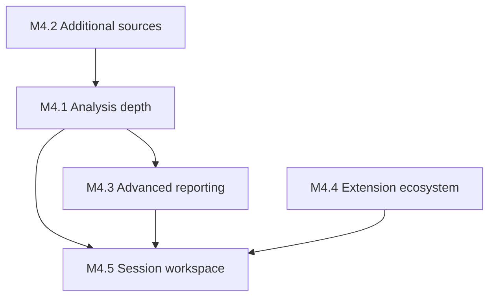

# M4 – Feature Expansion

| Field | Value |
|-------|-------|
| Document | M4 – Feature Expansion |
| Category | Project Planning |
| Version | 1.0.0 |
| Status | Approved |
| Created | 18-07-2026 |
| Last Updated | 18-07-2026 |

---

# 1. Purpose

This document defines the phased plan for **M4 – Feature Expansion** after the completion of M3 – Architecture Realization ([`v0.3.0`](../../CHANGELOG.md)).

It maps planned capabilities to functional requirements (FR-001 through FR-004), identifies gaps in the current baseline, and establishes implementation order without prescribing low-level design details.

---

# 2. Scope

This plan covers M4 phases M4.1 through M4.5 and explicitly defers REST API, Web UI, and AI-assisted investigation to post-M4 work.

It applies to:

- Core library extensions
- CLI enhancements
- Repository-level integration and end-to-end tests

It does not cover M5 production readiness activities (packaging, performance, fuzz testing, multi-platform CI).

---

# 3. M3 Baseline

M3 delivered the full architectural pipeline:

```text
ConfigurationManager → SourceManager → AnalysisEngine → AnalysisModel
                                              ↓
                         InvestigationEngine / ReportGenerator → CLI
```

### Current capabilities

| Area | M3 delivery |
|------|-------------|
| Source | Single file via `FileLogSource` |
| Analysis | Line count only in `AnalysisModel` |
| Investigation | Line-count filters; source path search |
| Reporting | Text report; CLI JSON with `source` and `totalLines` |
| Extensions | `PluginRegistry` metadata only; no `ExtensionManager` |
| Workspace | Placeholder directory only |

### Key limitation

`AnalysisModel` stores only `sourcePath` and `totalLines`. Investigation and reporting operate on metadata, not log content. This leaves significant gaps against FR-001 through FR-004 acceptance criteria.

---

# 4. Gap Analysis

| Requirement | Acceptance gap | Addressed by |
|-------------|----------------|--------------|
| FR-001.3 – Meaningful analysis results | Line count alone is insufficient | M4.1 |
| FR-001.4 – Unsupported format feedback | No format detection | M4.2 |
| FR-001.5 – Workflow continuity | N/A once sources extend additively | M4.2 |
| FR-002.1/2 – Search and filter | No log content search | M4.1 |
| FR-002.5 – Progressive investigation | No session persistence | M4.5 |
| FR-003.2 – Select report content | Full report only | M4.3 |
| FR-003.4 – Multiple formats | Text and basic JSON only | M4.3 |
| FR-004.2/5 – Extensions | No discovery or manager | M4.4 |

---

# 5. Evolution Strategy

M4 follows the product evolution order from [Product Overview](vision/PRODUCT_OVERVIEW.md):

1. **Built-in capability** — enrich core analysis and reporting (M4.1, M4.3)
2. **Configuration** — report section selection, extension enablement
3. **Plugin** — `ExtensionManager` with static built-in extensions (M4.4)
4. **SDK** — deferred to late M4 or post-M4

---

# 6. Phase Dependencies



| Phase | Depends on | Rationale |
|-------|------------|-----------|
| M4.1 | M3 complete | Extends existing `AnalysisModel` and pipeline |
| M4.2 | M3 complete | Parallel to M4.1; additive source types |
| M4.3 | M4.1 | Report sections need richer analysis data |
| M4.4 | M3 complete | Independent extension layer |
| M4.5 | M4.1, M4.3 | Sessions store investigation and report state |

**Recommended implementation order:** M4.1 → M4.2 → M4.3 → M4.4 → M4.5

---

# 7. Phase Descriptions

## M4.1 – Analysis Depth

**Primary FR:** FR-001, FR-002

Extend analysis to produce meaningful statistics from generic plain-text logs:

- Per-level line counts (INFO, WARN, ERROR) via pattern matching
- Optional aggregates (blank lines, average line length)
- Investigation filters by log level and content substring over indexed summaries
- Updated text, JSON, integration, and end-to-end tests

**Branch naming:** `feat/m4.1-analysis-depth`

**Acceptance:** `logscope analyze samples/sample.log` reports error and warning counts; investigation filters by level.

---

## M4.2 – Additional Source Types

**Primary FR:** FR-001

- `StdinLogSource` for pipe-friendly workflows
- Multi-file and directory dataset support
- Clear unsupported-input errors (FR-001.4)
- Optional stretch: compressed file support

**Branch naming:** `feat/m4.2-source-types`

**Acceptance:** `logscope analyze -` and directory input documented and tested.

---

## M4.3 – Advanced Reporting

**Primary FR:** FR-003

- Report sections: summary, level breakdown, source metadata
- Content selection via CLI flags or configuration (FR-003.2)
- CSV and Markdown output formats (FR-003.4)
- Reproducible output (FR-003.6)

**Branch naming:** `feat/m4.3-advanced-reporting`

---

## M4.4 – Extension Ecosystem

**Primary FR:** FR-004

- `ExtensionManager` per [Component Catalog](architecture/COMPONENT_CATALOG.md) C06
- Static built-in extension registration at startup
- Configuration-based enablement (FR-004.1)
- CLI: `extensions list`, `extensions describe` (FR-004.5)
- Failure isolation: extension errors must not crash core pipeline (FR-004.4)

Dynamic shared-library loading is a later sub-phase within M4.4.

**Branch naming:** `feat/m4.4-extension-ecosystem`

---

## M4.5 – Session / Workspace

**Primary FR:** FR-002 (progressive investigation)

- `core/workspace/` module for session persistence
- Save and load investigation filters, report preferences, analysis metadata
- CLI session commands

**Branch naming:** `feat/m4.5-workspace`

---

# 8. Non-Goals for M4

The following are explicitly out of scope for M4:

- REST API and Web interface
- AI-assisted investigation
- Full SDK / third-party plugin marketplace
- Performance optimization, fuzz testing, and release packaging (M5)
- Vendor-specific log format parsers (prefer generic patterns in M4.1)

---

# 9. Engineering Conventions

| Convention | Value |
|------------|-------|
| Branch prefix | `feat/m4.N-<short-name>` |
| PR pattern | Small, test-backed increments (same as M3) |
| Tests | Unit tests per module; update `logscope_integration_tests` and `logscope_e2e_tests` |
| Documentation | Update [Roadmap](ROADMAP.md) and [Changelog](../CHANGELOG.md) per phase |

---

# 10. Traceability

| Source artifact | Relationship |
|-----------------|--------------|
| [FR-001 – Analyze Logs](requirements/functional/FR-001-Analyze-Logs.md) | M4.1, M4.2 |
| [FR-002 – Investigate Logs](requirements/functional/FR-002-Investigate-Logs.md) | M4.1, M4.5 |
| [FR-003 – Generate Reports](requirements/functional/FR-003-Generate-Reports.md) | M4.3 |
| [FR-004 – Extend LogScope](requirements/functional/FR-004-Extend-LogScope.md) | M4.4 |
| [Product Overview](vision/PRODUCT_OVERVIEW.md) | Evolution strategy |
| [Roadmap](ROADMAP.md) | Milestone tracking |

---

# 11. Revision History

| Version | Date | Description |
|---------|------|-------------|
| 1.0.0 | 18-07-2026 | Initial M4 feature expansion plan. |
