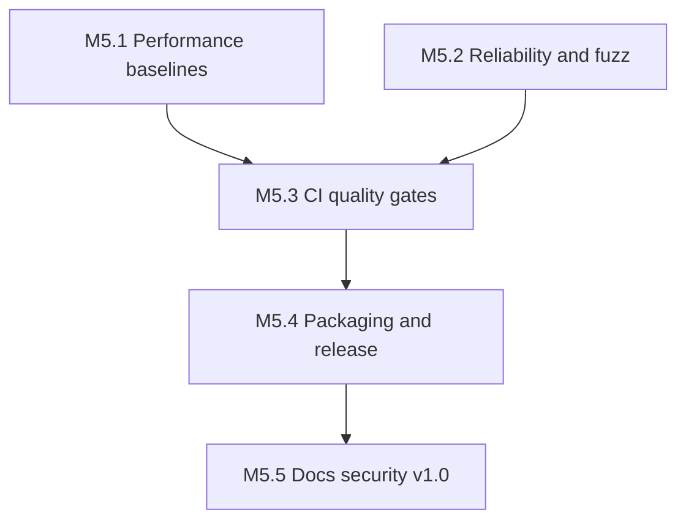

# M5 – Production Readiness

| Field | Value |
|-------|-------|
| Document | M5 – Production Readiness |
| Category | Project Planning |
| Version | 1.0.0 |
| Status | Complete |
| Created | 18-07-2026 |
| Last Updated | 18-07-2026 |

---

# 1. Purpose

This document defines the phased plan for **M5 – Production Readiness** after the completion of M4 – Feature Expansion ([`v0.4.0`](../../CHANGELOG.md)).

It maps production-hardening activities to [NFR-001 – Quality Attributes](../requirements/non_functional/NFR-001-Quality-Attributes.md) and establishes implementation order before the first stable release (`v1.0.0`).

---

# 2. Scope

This plan covers M5 phases M5.1 through M5.5:

- Performance baselines and measurable NFR-001 §3.1 evidence
- Reliability hardening and fuzz testing (NFR-001 §3.2)
- CI quality gates: multi-platform builds, static analysis, coverage (NFR-001 §3.3, §3.6)
- Packaging and release workflow (source install, then binary GitHub Releases)
- Documentation, security review, and v1.0.0 validation (NFR-001 §3.5)

It explicitly defers REST API, Web UI, AI-assisted investigation, dynamic plugin loading, and vendor-specific parsers to post-v1.0 work.

---

# 3. M4 Baseline

M4 delivered the full feature pipeline at [`v0.4.0`](../../CHANGELOG.md):

```text
ConfigurationManager → SourceManager → AnalysisEngine → AnalysisModel
                                              ↓
              InvestigationEngine / ReportGenerator / ExtensionManager
                                              ↓
                         SessionStore → CLI (analyze, extensions, session)
```

### Current capabilities

| Area | M4 delivery |
|------|-------------|
| Analysis | Per-level line counts, content-aware filters |
| Sources | File, stdin, directory/composite |
| Reporting | Text, JSON, CSV, Markdown with section selection |
| Extensions | `ExtensionManager`, config enablement, CLI discovery |
| Workspace | `.logscope-session` persistence |
| Tests | 230 automated tests (unit, integration, end-to-end) |
| CI | Ubuntu-only build and test |

### Key gaps (addressed by M5)

| Gap | NFR | Addressed by |
|-----|-----|--------------|
| No performance baselines | §3.1 | M5.1 |
| No fuzz or sanitizer coverage | §3.2 | M5.2 |
| Single-platform CI | §3.6 | M5.3 |
| No install or release packaging | §3.6 | M5.4 |
| Incomplete release/testing docs | §3.3, §3.5 | M5.5 |

---

# 4. Phase Dependencies



| Phase | Depends on | Rationale |
|-------|------------|-----------|
| M5.1 | M4 complete | Benchmarks need stable pipeline |
| M5.2 | M4 complete | Fuzz targets parsers from M3–M4 |
| M5.3 | M5.1, M5.2 | CI runs benchmarks and fuzz jobs |
| M5.4 | M5.3 | Release workflow needs green multi-OS CI |
| M5.5 | M5.4 | v1.0.0 validates full distribution |

**Recommended implementation order:** M5.1 → M5.2 → M5.3 → M5.4 → M5.5

---

# 5. Phase Descriptions

## M5.1 – Performance Baselines

**Primary NFR:** NFR-001 §3.1 (Performance), §3.7 (Observability)

- Google Benchmark harness under `tests/benchmarks/`
- Benchmarks for `detectLogLevel`, `AnalysisEngine::analyze`, and end-to-end file analysis
- Baseline JSON and [`PERFORMANCE.md`](../testing/PERFORMANCE.md)
- ADR-002: benchmark framework selection

**Branch naming:** `feat/m5.1-performance-baselines`

**Acceptance:** Benchmarks run locally and in CI (non-gating); documented lines/sec for synthetic workloads.

---

## M5.2 – Reliability and Fuzz Testing

**Primary NFR:** NFR-001 §3.2 (Reliability)

- libFuzzer targets under `tests/fuzz/` (Linux CI, `FUZZING=ON`)
- Cross-platform malformed-input GoogleTest suites for session serializer, configuration, CLI parser, UUID
- Sanitizer build preset (`cmake/Sanitize.cmake`)
- Negative integration tests for corrupt session and config files

**Branch naming:** `feat/m5.2-fuzz-reliability`

**Acceptance:** Fuzz runs in CI on Linux; malformed-input tests pass on all platforms; no crashes on corrupt fixtures.

---

## M5.3 – CI Quality Gates

**Primary NFR:** NFR-001 §3.3 (Maintainability), §3.6 (Portability)

- Multi-OS matrix: Ubuntu, Windows, macOS
- `clang-tidy` target (`cmake/Tidy.cmake`)
- Coverage job with `gcov`/`lcov` artifact
- Benchmark regression check against committed baseline
- `.gitignore` hygiene for test artifacts

**Branch naming:** `feat/m5.3-ci-quality-gates`

**Acceptance:** Green CI on three OSes; coverage and clang-tidy run on PRs; Ubuntu `cli-matrix` job exercises 18 CLI scenarios on 10k-line bulk logs.

---

## M5.4 – Packaging and Release Workflow

**Primary NFR:** NFR-001 §3.6 (Portability)

### M5.4a – Source packaging

- CMake `install()` for `logscope` CLI
- CPack TGZ/ZIP archives
- [`RELEASE.md`](../release/RELEASE.md) maintainer guide

### M5.4b – Binary releases

- Tag-triggered `.github/workflows/release.yml`
- Per-OS artifacts attached to GitHub Releases
- Smoke test each artifact

**Branch naming:** `feat/m5.4-packaging-release`

**Acceptance:** `cmake --install` and CPack work; tagging produces downloadable binaries.

**Optional interim release:** `v0.5.0` after M5.3 + M5.4a.

---

## M5.5 – Documentation, Security Review, and v1.0.0

**Primary NFR:** NFR-001 §3.5 (Usability)

- [`TESTING.md`](../testing/TESTING.md), [`SECURITY_REVIEW.md`](../handbook/SECURITY_REVIEW.md), CLI reference
- v1.0.0 validation checklist in [`V1_VALIDATION.md`](../release/V1_VALIDATION.md)
- Update README, ROADMAP, PRODUCT, DOCUMENT_MAP
- Ship `v1.0.0` with changelog and GitHub Release binaries

**Branch naming:** `feat/m5.5-v1-release`

**Acceptance:** M5 marked complete; `v1.0.0` tagged and released.

---

# 6. Non-Goals for M5

- REST API and Web interface
- AI-assisted investigation
- Dynamic shared-library plugin loading
- Vendor-specific log format parsers
- Full SDK / marketplace
- Enterprise features (auth, multi-tenancy)

---

# 7. Engineering Conventions

| Convention | Value |
|------------|-------|
| Branch prefix | `feat/m5.N-<short-name>` |
| PR pattern | Small, test-backed increments (same as M3/M4) |
| Tests | Extend unit, integration, e2e, benchmark, and fuzz targets |
| Documentation | Update ROADMAP and CHANGELOG per phase |

---

# 8. Traceability

| Source artifact | Relationship |
|-----------------|--------------|
| [NFR-001 – Quality Attributes](../requirements/non_functional/NFR-001-Quality-Attributes.md) | Primary driver for all M5 phases |
| [FR-001 – Analyze Logs](../requirements/functional/FR-001-Analyze-Logs.md) | Performance and reliability of analysis |
| [FR-002 – Investigate Logs](../requirements/functional/FR-002-Investigate-Logs.md) | Session hardening |
| [FR-003 – Generate Reports](../requirements/functional/FR-003-Generate-Reports.md) | Report pipeline benchmarks |
| [FR-004 – Extend LogScope](../requirements/functional/FR-004-Extend-LogScope.md) | Extension isolation under fuzz |
| [M4 – Feature Expansion](M4-FEATURE-EXPANSION.md) | Predecessor milestone |
| [Roadmap](../ROADMAP.md) | Milestone tracking |

---

# 9. Revision History

| Version | Date | Description |
|---------|------|-------------|
| 1.0.0 | 18-07-2026 | Initial M5 production readiness plan. |
