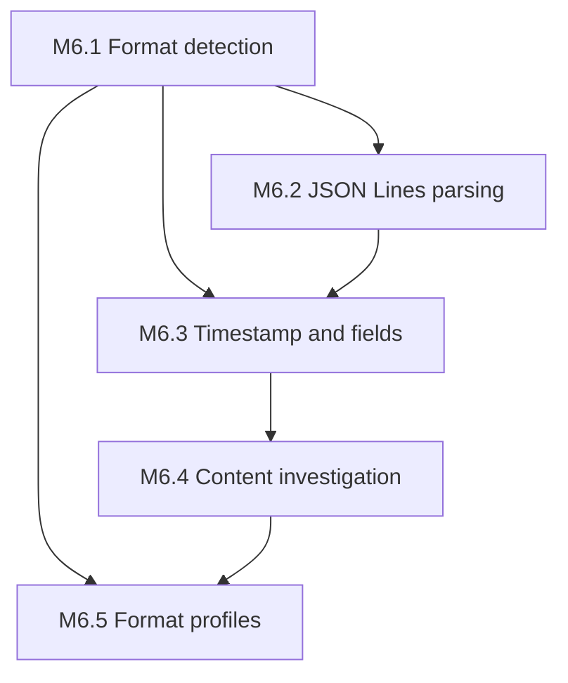

# M6 – Log Format Intelligence

| Field | Value |
|-------|-------|
| Document | M6 – Log Format Intelligence |
| Category | Project Planning |
| Version | 1.3.0 |
| Status | In Progress |
| Created | 18-07-2026 |
| Last Updated | 21-07-2026 |

---

# 1. Purpose

This document defines the phased plan for **M6 – Log Format Intelligence** after the first stable production release ([`v1.0.0`](../../CHANGELOG.md)).

It maps format-aware analysis capabilities to functional requirements (FR-001, FR-002, FR-004) and establishes implementation order for deepening LogScope beyond plain-text heuristics while preserving the CLI-first, technology-independent product promise.

Target release: **`v1.1.0`** at M6 completion.

---

# 2. Scope

This plan covers M6 phases M6.1 through M6.5:

- Format detection and actionable unsupported-format feedback (FR-001.4)
- Structured log parsing starting with JSON Lines / NDJSON (FR-001.1, FR-001.3)
- Generic timestamp and field extraction for richer analysis models (FR-001.3)
- Content-aware investigation: line search, time-range filters, basic correlation (FR-002.1, FR-002.2, FR-002.4)
- Configurable format profiles as the preferred customization path (FR-004.1)

It explicitly defers REST API, Web UI, AI-assisted investigation, dynamic shared-library plugin loading, vendor-specific parsers, and a full extension SDK to post-M6 work (see [Non-Goals](#9-non-goals-for-m6)).

---

# 3. v1.0.0 Baseline

M5 delivered production readiness at [`v1.0.0`](../../CHANGELOG.md). The analysis pipeline is stable but format-agnostic in the weakest sense: it treats every line as opaque plain text.

```text
ConfigurationManager → SourceManager → AnalysisEngine → AnalysisModel
                                              ↓
              InvestigationEngine / ReportGenerator / ExtensionManager
                                              ↓
                         SessionStore → CLI (analyze, extensions, session)
```

### Current capabilities

| Area | v1.0.0 delivery |
|------|-----------------|
| Sources | File, stdin, directory/composite |
| Analysis | Line count + heuristic INFO/WARN/ERROR keyword detection |
| Investigation | Aggregate level filters; source-path substring search only |
| Reporting | Text, JSON, CSV, Markdown with section selection |
| Extensions | Static built-in registration; config enablement |
| Workspace | `.logscope-session` persistence |
| Tests | 246 automated tests; benchmarks, fuzz, multi-OS CI |
| Distribution | CMake install, CPack, GitHub Release binaries |

### Key gaps (addressed by M6)

| Gap | FR | Addressed by |
|-----|-----|--------------|
| No format identification beyond readable text | FR-001.4 | M6.1 |
| Analysis produces aggregates only; no fields or timestamps | FR-001.3 | M6.2, M6.3 |
| Investigation cannot search log line content | FR-002.1 | M6.4 |
| No time-range or field-based filtering | FR-002.2 | M6.4 |
| No correlation across related log events | FR-002.4 | M6.4 |
| Format behaviour is not configurable | FR-004.1 | M6.5 |

### Current limitation

`AnalysisEngine` scans lines once, classifies level by keyword heuristics, and discards line content. `InvestigationEngine::searchSource` matches against the source path, not log text. `AnalysisModel` stores only `sourcePath`, `totalLines`, and `LogLevelCounts`.

This satisfies v1.0.0 acceptance for generic plain-text logs but leaves FR-001.3 and FR-002.4 only partially met for structured or semi-structured formats.

---

# 4. Evolution Strategy

M6 continues the product evolution order from [Product Overview](../vision/PRODUCT_OVERVIEW.md):

1. **Built-in capability** — generic format detection, JSON Lines parser, timestamp extraction (M6.1–M6.3)
2. **Configuration** — format profiles, field hints, investigation defaults (M6.5)
3. **Plugin** — dynamic parser extensions deferred to M7
4. **SDK** — deferred to M7+

M6 stays **technology-independent**: parsers target generic formats (plain text, JSON Lines, common timestamp prefixes, RFC 5424-style syslog subsets) rather than vendor-specific schemas.

---

# 5. Phase Dependencies



| Phase | Depends on | Rationale |
|-------|------------|-----------|
| M6.1 | v1.0.0 complete | Detection gates parser selection |
| M6.2 | M6.1 | JSON Lines is the first structured format |
| M6.3 | M6.1, M6.2 | Field model spans plain and structured lines |
| M6.4 | M6.3 | Search and filters need indexed fields or line store |
| M6.5 | M6.1, M6.4 | Profiles configure detection and investigation defaults |

**Recommended implementation order:** M6.1 → M6.2 → M6.3 → M6.4 → M6.5

---

# 6. Phase Descriptions

## M6.1 – Format Detection

**Status:** ✅ Complete (merged via PR #28)

**Primary FR:** FR-001.4, FR-001.2

Introduce a format identification layer before analysis:

- `LogFormat` enumeration: `PlainText`, `JsonLines`, `Unknown` (extensible)
- `FormatDetector` samples leading lines and assigns a format with confidence
- `SourceManager` / `AnalysisEngine` surface detected format in diagnostics and reports
- Clear, actionable errors when input is binary, empty, or unrecognisable (FR-001.4)
- CLI: optional `--format auto|plain|jsonl` override (manual hint before M6.5 profiles)

**Branch naming:** `feat/m6.1-format-detection`

**Acceptance:**

- `logscope analyze samples/sample.log` reports detected format `plain`
- Invalid binary input produces a clear error without crash
- Existing plain-text workflows unchanged when format is auto-detected

---

## M6.2 – JSON Lines Parsing

**Status:** 🔄 In progress (`feat/m6.2-json-lines`)

**Primary FR:** FR-001.1, FR-001.3

Add first-class support for newline-delimited JSON (NDJSON / JSON Lines):

- `JsonLinesLogSource` or parser adapter that validates JSON per line
- Extend `AnalysisModel` (or companion `ParsedLogSummary`) with JSON-specific stats: valid lines, parse failures, common top-level keys
- Map common level fields (`level`, `severity`, `log.level`) to `LogLevelCounts` where present
- Sample fixtures under `samples/` (e.g. `sample.jsonl`)
- Malformed-line handling: count failures, continue analysis, report in output

**Branch naming:** `feat/m6.2-json-lines`

**Acceptance:**

- `logscope analyze samples/sample.jsonl` succeeds with field-aware statistics
- Mixed invalid JSON lines are reported without aborting the full analysis
- Plain-text `analyze` workflow remains unchanged (FR-001.5)

---

## M6.3 – Timestamp and Field Extraction

**Primary FR:** FR-001.3

Enrich the analysis model with generic, format-aware fields:

- `LogRecord` or indexed line summary: line number, optional timestamp, level, message excerpt
- Plain-text: detect common timestamp prefixes (ISO-8601, `YYYY-MM-DD HH:MM:SS`)
- JSON Lines: extract timestamp and message fields from configured/default key names
- `AnalysisModel` extensions: time range (min/max), top recurring message patterns (bounded sample)
- Memory bounds: configurable max indexed lines or streaming summary for large files (document in `PERFORMANCE.md`)

**Branch naming:** `feat/m6.3-field-extraction`

**Acceptance:**

- Reports include detected time range when timestamps are present
- JSON and plain-text samples show field-aware summary sections
- Benchmark baselines updated; no regression beyond agreed tolerance

---

## M6.4 – Content-Aware Investigation

**Primary FR:** FR-002.1, FR-002.2, FR-002.4

Replace path-only search with log-content investigation:

- `searchContent(query)` over indexed lines or on-demand line scan
- `TimeRangeFilter` for investigation by timestamp window
- `FieldFilter` for level, key presence, or substring match on message
- Basic correlation: surface repeated error messages and shared correlation/trace IDs when detected in JSON or plain text
- CLI: `investigate` subcommand flags or extend `analyze --investigate` flow
- Session persistence updated for new filter types (workspace serializer versioning)

**Branch naming:** `feat/m6.4-content-investigation`

**Acceptance:**

- Users can search log content without re-running full analysis where index exists
- Time-range filter narrows results on timestamped fixtures
- Session save/load preserves new filter state
- FR-002.5 progressive investigation preserved

---

## M6.5 – Format Profiles and Configuration

**Primary FR:** FR-004.1, FR-001.2

Make format behaviour configurable before introducing dynamic plugins:

- `logscope.properties` keys: `source.format`, `source.json.timestamp_field`, `source.json.level_field`, `investigation.max_indexed_lines`
- Named format profiles (e.g. `profile=generic-json`) loadable via `--profile` or config
- `config validate` extended for new keys
- Documentation: format profile guide in CLI reference
- Prepare `FormatParser` interface for M7 dynamic extensions (header-only contract, static registration initially)

**Branch naming:** `feat/m6.5-format-profiles`

**Acceptance:**

- Custom JSON field mapping works via configuration without code changes
- `config validate` catches invalid profile keys
- M6 success criteria met; ready to tag `v1.1.0`

---

# 7. M6 Success Criteria

M6 is considered complete when:

- FR-001.3 is met for plain text and JSON Lines with field-aware summaries.
- FR-001.4 provides format identification and actionable unsupported-input feedback.
- FR-002.1 supports content search; FR-002.2 supports time and field filters.
- FR-002.4 delivers basic correlation (repeated errors, shared IDs) on sample fixtures.
- FR-004.1 allows format customization through configuration profiles.
- All M6 phases have unit, integration, and end-to-end test coverage.
- Benchmark and fuzz targets updated for new parsers; CI remains green on Ubuntu, Windows, macOS.
- `v1.1.0` tagged and released with changelog and binaries.

---

# 8. Engineering Conventions

| Convention | Value |
|------------|-------|
| Branch prefix | `feat/m6.N-<short-name>` |
| PR pattern | Small, test-backed increments (same as M3–M5) |
| Tests | Unit per module; extend integration, e2e, fuzz, and benchmarks |
| Documentation | Update ROADMAP, CHANGELOG, CLI reference, and PERFORMANCE.md per phase |
| Version | Remain `1.0.0` during M6 development; bump to `1.1.0` in final release PR |

---

# 9. Non-Goals for M6

The following remain out of scope for M6:

- REST API and Web interface
- AI-assisted investigation
- Dynamic shared-library plugin loading (planned for M7)
- Vendor-specific log format parsers (Splunk, Datadog proprietary schemas, etc.)
- Full extension SDK / marketplace
- Compressed archive sources (`.gz`, `.zip`) — optional stretch only
- Enterprise features (auth, multi-tenancy, remote storage)

---

# 10. Traceability

| Source artifact | Relationship |
|-----------------|--------------|
| [FR-001 – Analyze Logs](../requirements/functional/FR-001-Analyze-Logs.md) | Format support, meaningful results, unsupported feedback |
| [FR-002 – Investigate Logs](../requirements/functional/FR-002-Investigate-Logs.md) | Content search, filters, correlation |
| [FR-004 – Extend LogScope](../requirements/functional/FR-004-Extend-LogScope.md) | Configuration-first format profiles |
| [Product Overview](../vision/PRODUCT_OVERVIEW.md) | Product promise and evolution strategy |
| [M5 – Production Readiness](M5-PRODUCTION-READINESS.md) | Predecessor milestone |
| [Roadmap](../ROADMAP.md) | Milestone tracking |

---

# 11. Revision History

| Version | Date | Description |
|---------|------|-------------|
| 1.0.0 | 18-07-2026 | Initial M6 log format intelligence plan. |
| 1.1.0 | 21-07-2026 | M6.1 format detection implementation in progress. |
| 1.2.0 | 21-07-2026 | M6.1 complete; M6.2 JSON Lines parsing is next. |
| 1.3.0 | 21-07-2026 | M6.2 JSON Lines parsing implementation in progress. |
