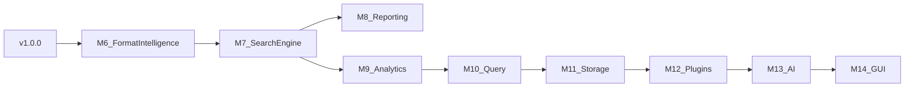

# Post-v1 Strategic Roadmap

| Field | Value |
|-------|-------|
| Document | Post-v1 Strategic Roadmap |
| Category | Project Planning |
| Version | 1.2.0 |
| Status | Approved |
| Created | 21-07-2026 |
| Last Updated | 24-07-2026 |

---

# 1. Purpose

This document defines the long-term strategic direction for LogScope after the first stable production release ([`v1.0.0`](../../CHANGELOG.md)).

It captures the consolidated post-v1 vision across ten strategic phases, maps each phase to tactical milestones (M6–M17), and establishes version targets. Tactical implementation details live in per-milestone planning documents; this document is the strategic layer.

See also: [Roadmap](../ROADMAP.md) for milestone tracking and status.

---

# 2. Executive Summary

LogScope is a professional, extensible log analysis platform. The product promise is:

> **Analyze any log format without writing custom scripts.**

With v1.0.0 complete, the engineering foundation is in place. Post-v1 work extends the product incrementally:

1. Stabilize the v1.x line (documentation, observability, stress testing).
2. Deepen format intelligence and search (find information fast).
3. Enrich reporting and analytics (understand patterns).
4. Introduce query language and persistent storage (scale investigations).
5. Expand the plugin ecosystem (extensibility without core changes).
6. Add AI-assisted insights (bounded, optional).
7. Deliver GUI and Web surfaces (v2.0 major evolution).
8. Pursue enterprise and cloud deployment (long-term).

**Confirmed priority order:** Search → Reporting → Analytics → Query → AI → GUI → Web → Enterprise.

**Immediate next milestone:** M10 – Query Language (`v1.4.0`). Search (M7 / `v1.2.0`), Advanced Reporting (M8 / `v1.3.0`), and Analytics Engine (M9 / `v1.3.1`) are complete; see [Roadmap](../ROADMAP.md).

---

# 3. Product Boundaries

LogScope intentionally avoids becoming (see [Product Overview §8](../vision/PRODUCT_OVERVIEW.md)):

- A vendor-specific analysis tool.
- A replacement for observability platforms.
- A monitoring system or log collection agent.
- A log storage platform or general-purpose data processing framework.

The primary responsibility remains helping engineers **understand existing log data**. Enterprise collection, real-time monitoring, and alerting remain out of scope unless explicitly re-chartered.

---

# 4. Documentation Model

```text
POST_V1_STRATEGIC_ROADMAP.md  ← public strategic layer (this document)
        │
        ├── M6–Mn planning docs  ← public tactical plans when implementation starts
        │
        ▼
    ROADMAP.md  ← public milestone status
```

Long-horizon product themes beyond the published public milestones are maintained privately. They appear in this repository only as public `Mn` planning documents when implementation is about to start. This repository does not link to any private strategy location.

---

# 5. Strategic Phases

## Phase 1 — Stabilize v1.x

**Goal:** Make LogScope rock solid before adding major new capabilities.

**Runs as a parallel `v1.0.x` maintenance track** alongside feature milestones. Not a blocker for M6.

### Documentation

- Complete API documentation (Doxygen generation and CI publish)
- Architecture diagrams (update HLD and Component Catalog visuals)
- Developer guide
- Plugin development guide
- Configuration guide
- User manual
- Examples and tutorials

### Testing

Expand and harden beyond the v1.0.0 baseline:

| Capability | v1.0.0 status | Phase 1 target |
|------------|---------------|----------------|
| Integration tests | Done (`tests/integration/`) | Expand coverage |
| End-to-end tests | Done (`tests/end_to_end/`) | Expand scenarios |
| Regression tests | Placeholder (`tests/regression/`) | Populate with known issues |
| Fuzz testing | Done (`tests/fuzz/`) | Add targets for new parsers |
| Performance benchmarks | Done (`tests/benchmarks/`) | Expand baselines |
| Memory leak testing | Partial (sanitizer CI) | Harden ASan/LSan jobs |
| Stress testing (large logs) | Not done | Add large-fixture stress suite |

### Performance

Areas to optimize (deferred in part to M6/M7 where they have highest impact):

- Parser throughput
- Memory usage and allocation reduction
- SIMD optimizations (where beneficial)
- Thread pool tuning
- Multi-core processing
- Zero-copy parsing

### Observability

LogScope should expose its own diagnostics:

- Internal metrics
- Execution timeline
- Performance profiler
- Parser statistics
- Plugin loading metrics
- Memory statistics

---

## Phase 2 — Product Features

Core product capabilities that deliver user value on the CLI-first platform.

### Search Engine (M7)

A dedicated search subsystem building on M6 field extraction and line indexing:

- Full-text search
- Regex search
- Boolean queries
- Time range filtering
- Field filtering
- Saved searches
- Search history

### Analytics Engine (M9)

Higher-level analysis beyond aggregates:

- Frequency analysis
- Error clustering
- Pattern detection
- Event correlation
- Timeline analysis
- Root cause assistance
- Trend analysis

### Reporting Engine (M8)

Extend the existing text/JSON/CSV/Markdown reporting:

- HTML and PDF output
- Executive summary, error summary, performance summary
- Timeline and chart sections
- Plugin-generated report sections

### Query Engine (M10)

Introduce a structured query language:

```text
level == ERROR
service == "PCF"
time > "2026-01-01"
contains(message, "timeout")
```

Evolves toward a SQL-like or DSL-based query language over indexed log data.

---

## Phase 3 — Storage (M11)

Improve storage beyond flat files:

- SQLite-backed indexed storage
- Compression
- Incremental indexing
- Cached queries
- Enhanced session persistence
- Workspace management at scale

**Guardrail:** In-memory / streaming index first (M6–M7); persistent storage only when query patterns justify it. Requires ADR before implementation.

---

## Phase 4 — Plugin Ecosystem (M12)

Plugin categories:

- Parsers
- Report generators
- Search providers
- Exporters
- AI analyzers
- Storage providers
- Visualization modules

Later capabilities:

- Plugin marketplace
- Plugin versioning
- Plugin sandboxing
- Plugin signing

**Guardrail:** Configuration before plugins (M6.5 format profiles before M12 dynamic loading). Requires ADR before `.so`/`.dll` loading.

---

## Phase 5 — AI (M13)

Bounded AI-assisted capabilities:

- Explain errors
- Cluster similar failures
- Detect anomalies
- Root cause suggestions
- Generate summaries
- Suggest fixes
- Natural language queries

Examples:

> "Why did the service crash?"
> "Show login failures from yesterday."
> "Summarize all ERROR logs."

**Guardrail:** AI is assistive, not autonomous. Scope and data handling require ADR before implementation.

---

## Phase 6 — GUI (M14)

Desktop application (Qt is the long-term direction; requires ADR):

- Open log files
- Live tail
- Filters, timeline, search, charts
- Plugin management
- Report generation
- Dark/light themes

**Guardrail:** GUI consumes core APIs; no UI-specific logic in `core/`.

---

## Phase 7 — Web UI (M15)

Browser-based interface:

- Dashboard
- Multi-user support
- Remote log viewing
- Shared investigations
- Saved workspaces
- REST API integration

---

## Phase 8 — Enterprise (M16)

Long-term enterprise capabilities:

- Remote agents
- Distributed log collection
- Streaming
- Real-time monitoring
- Alerts
- Multi-node deployments
- RBAC
- Audit logging

**Guardrail:** Remains outside product boundaries unless explicitly re-chartered.

---

## Phase 9 — Cloud (M17)

Future deployment options:

- Kubernetes
- Docker
- Helm charts
- REST API
- gRPC
- OpenTelemetry integration
- Prometheus metrics

---

## Phase 10 — Ecosystem

The broader companion product vision:

- LogScope CLI
- LogScope Desktop
- LogScope Web
- LogScope SDK
- LogScope Plugin SDK
- LogScope AI
- LogScope Cloud

---

# 6. Phase-to-Milestone Mapping

| Strategic phase | Tactical milestone | Target version |
|-----------------|-------------------|----------------|
| Phase 1 — Stabilize v1.x | Parallel `v1.0.x` track | `v1.0.1`–`v1.0.x` |
| M6 — Log Format Intelligence | M6 | `v1.1.0` |
| Phase 2 — Search Engine | M7 | `v1.2.0` |
| Phase 2 — Reporting Engine | M8 | `v1.3.0` |
| Phase 2 — Analytics Engine | M9 | `v1.3.1`+ |
| Phase 2 — Query Engine | M10 | `v1.4.0` |
| Phase 3 — Storage | M11 | `v1.4.0` |
| Phase 4 — Plugin Ecosystem | M12 | `v1.4.0` / `v1.5.0` |
| Phase 5 — AI | M13 | `v1.5.0` |
| Phase 6 — GUI | M14 | `v2.0.0` |
| Phase 7 — Web UI | M15 | `v2.0.0` |
| Phase 8 — Enterprise | M16 | `v2.x` |
| Phase 9 — Cloud | M17 | `v2.x` |
| Phase 10 — Ecosystem | Cross-cutting | `v2.x+` |



---

# 7. Version Roadmap

```text
v1.0.x  — Stabilize: docs, bugfixes, observability, stress tests
v1.1.0  — M6: Log Format Intelligence
v1.2.0  — M7: Search Engine (+ performance wins)
v1.3.0  — M8: Advanced Reporting
v1.3.1+ — M9: Analytics Engine (planned)
v1.4.0  — M10 Query + M11 Storage + M12 Plugins
v1.5.0  — M13 AI
v2.0.0  — M14 GUI + M15 Web + major API evolution
v2.x    — M16 Enterprise, M17 Cloud, ecosystem
```

---

# 8. v1.0.0 Baseline Audit

The following are **already delivered** at v1.0.0 and should not be re-planned:

| Area | Evidence |
|------|----------|
| Unit tests | `core/*/tests/`, `apps/cli/tests/` (246 tests) |
| Integration tests | `tests/integration/` |
| End-to-end tests | `tests/end_to_end/` |
| Fuzz testing | `tests/fuzz/` (libFuzzer targets) |
| Benchmarks | `tests/benchmarks/`, [`PERFORMANCE.md`](../testing/PERFORMANCE.md) |
| Multi-OS CI | Ubuntu, Windows, macOS (`.github/workflows/ci.yml`) |
| Coverage | CI coverage job |
| Static analysis | clang-tidy CI job |
| Packaging | CMake install, CPack, GitHub Release binaries |
| Security review | [`SECURITY_REVIEW.md`](../handbook/SECURITY_REVIEW.md) |

### Phase 1 gaps (v1.0.x track)

| Gap | Proposed delivery |
|-----|-------------------|
| Generated Doxygen site + CI publish | `v1.0.1` |
| User manual, plugin dev guide, config guide, tutorials | `v1.0.x` |
| Architecture diagrams | `v1.0.x` |
| Stress tests with large log fixtures | `v1.0.x` |
| Memory leak / ASan CI hardening | `v1.0.x` |
| Internal metrics / parser stats | `v1.0.x` or early M6 |
| SIMD / thread pool / zero-copy | M6 perf pass + M7 search indexing |

---

# 9. Engineering Improvements

Ongoing engineering practices (some already complete at v1.0.0):

| Practice | v1.0.0 status |
|----------|---------------|
| Increase test coverage | Ongoing |
| Expand benchmarking | Baselines established; expand per milestone |
| Static analysis (clang-tidy) | Done |
| API compatibility checks | Planned |
| Automated release notes | Partial (CHANGELOG + release workflow) |
| Security scanning | Planned |
| Dependency/license scanning | Planned |
| Cross-platform CI | Done |
| Packaging (MSI, DEB, RPM, Homebrew) | CPack + GitHub Releases done; distro packages planned |

---

# 10. Architectural Guardrails

1. **Search before Storage** — in-memory / streaming index first (M6–M7); SQLite (M11) only when query patterns justify persistence.
2. **Configuration before plugins** — format profiles (M6.5) before dynamic parsers (M12).
3. **CLI-first until v2.0** — GUI/Web consume the same core APIs; no UI-specific logic in `core/`.
4. **Product boundaries** — enterprise collection, monitoring, and alerting remain out of scope unless re-chartered.
5. **ADR gates** — Qt GUI, SQLite storage, query DSL grammar, and AI integration each require an ADR before coding starts.

---

# 11. Traceability

| Source artifact | Relationship |
|-----------------|--------------|
| [FR-001 – Analyze Logs](../requirements/functional/FR-001-Analyze-Logs.md) | Format support, meaningful results |
| [FR-002 – Investigate Logs](../requirements/functional/FR-002-Investigate-Logs.md) | Search, filters, correlation |
| [FR-003 – Generate Reports](../requirements/functional/FR-003-Generate-Reports.md) | Reporting enhancements |
| [FR-004 – Extend LogScope](../requirements/functional/FR-004-Extend-LogScope.md) | Plugins, configuration |
| [NFR-001 – Quality Attributes](../requirements/non_functional/NFR-001-Quality-Attributes.md) | Performance, reliability, maintainability |
| [Product Overview](../vision/PRODUCT_OVERVIEW.md) | Product promise and evolution strategy |
| [M6 – Log Format Intelligence](M6-LOG-FORMAT-INTELLIGENCE.md) | Completed at `v1.1.0` |
| [M7 – Search Engine](M7-SEARCH-ENGINE.md) | Completed at `v1.2.0` |
| [M8 – Advanced Reporting](M8-ADVANCED-REPORTING.md) | Completed at `v1.3.0` |
| [Roadmap](../ROADMAP.md) | Milestone status |

---

# 12. Revision History

| Version | Date | Description |
|---------|------|-------------|
| 1.0.0 | 21-07-2026 | Initial post-v1 strategic roadmap. |
| 1.1.0 | 24-07-2026 | M8 complete at `v1.3.0`; M9 analytics deferred to follow-on release. |
| 1.2.0 | 24-07-2026 | Next milestone M9; private themes stay unpublished until graduated. |